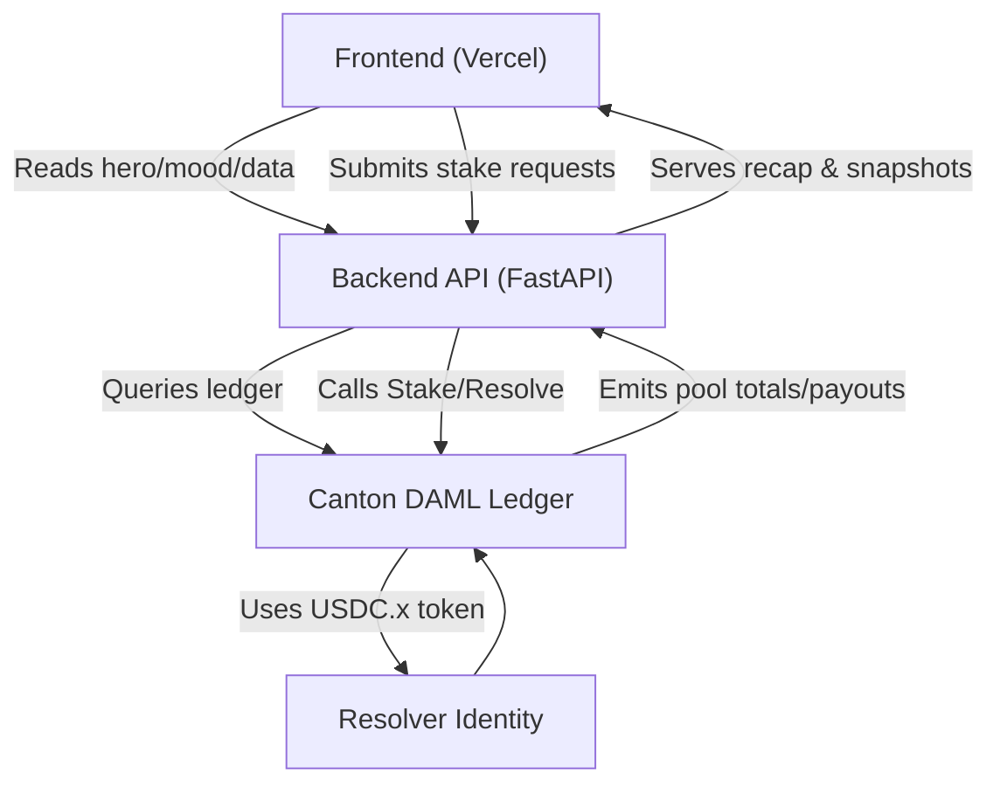

# Canton Architecture — DAML Weekly Pool

> Suggested architecture notes; not prescriptive but aligned to the weekly pool focus.

## Diagram (conceptual)
The flow for DAML designers and backend developers:

Component responsibilities:

- **Frontend**: hero question, market mood, stake module, resolver info, recap card.
- **Backend API**: orchestrates DAML calls, provides REST surface, logs snapshots.
- **Canton Ledger**: DAML templates enforce pool invariants; USDC.x transfers winnings.
- **Resolver**: Canton identity (signer/oracle) triggers `Resolve`; UI surfaces identity/source.

## 1. Ledger & contract layer (DAML on Canton)
- **Template**: `WeeklyMarket` tracks question, resolution time, Yes/No pools, resolver status, and settled flag.
- **Choices**:
  - `Stake`: participants lock USDC.x into their chosen side; ledger records total pools.
  - `Resolve`: resolver (designated signer/oracle) closes stakes, computes payouts, transfers USDC.x, marks `Resolved`.
  - Optional: `Create`/`Close` choices allow operator control over lifecycle.
- **Assets**: use Canton’s USDC.x token (native) for staking/payout; ledger enforces atomic transfers.
- **Invariant**: payouts equal total pool minus house fee (5%), distributed proportionally to winning stakes.

## 2. Backend “DMA” service
- **Responsibilities**:
  - Fetch market state from Canton (stake totals, participant counts, resolver status).
  - Expose REST endpoints:
    * `GET /market/current` → hero data, countdown, mood split.
    * `POST /market/{id}/stake` → submits stake choice (calls DAML `Stake`).
    * `POST /market/{id}/resolve` → authorized resolver triggers DAML `Resolve`.
    * `GET /market/{id}/recap` → post-resolution summary + participant snapshot.
  - Record top stakes/participants in local DB for UI.
- **Tech**:
  - FastAPI (Python) or lightweight Kotlin/Java service.
  - Canton SDK/gRPC client to invoke DAML choices and query ledger.
  - Minimal DB for snapshots/logs (SQLite/Postgres).

## 3. Frontend (Vercel)
- **Data flows**:
  - Poll `GET /market/current` for live mood + countdown.
  - Display hero, mood bar, resolver info, stake module, recap card, upcoming vote teaser.
  - Submit stake inputs through backend; show inline confirmation.
- **UI cues**: “participants”, “stake”, “pool”, “resolution”; calm styling; recap footers emphasise “Resolved on Canton · DAML execution complete”.

## 4. Operations & governance
- **Cadence**: weekly schedule (vote ends → trade window opens → resolver executes).
- **Resolver**: Canton identity or oracle role, recorded in UI (“Resolution by: ...”).
- **House fee**: 5% fee applied when computing payouts in DAML `Resolve`.
- **Audit log**: backend persists participant snapshot, payout amounts, timestamp for the recap card and ops review.

## 5. Extension hooks
- **Grok/AI**: backend can append AI insight text to `GET /market/current` without touching DAML.
- **Vote candidates**: backend or a simple editorial table drives the weekly vote UI.
- **Badges/incentives**: later add a DAML `Badge` template triggered after `Resolve` using same data.

## Diagram (conceptual)
Use this to explain the flow to Daml designers and backend devs:

Add labels in presentations:

- **Frontend**: hero question, market mood, stake module, resolver info, recap card.
- **Backend API**: orchestrates DAML calls, provides REST surface, logs snapshots.
- **Canton Ledger**: DAML templates enforce pool invariants; USDC.x transfers winnings.
- **Resolver**: Canton identity (signer/oracle) triggers `Resolve`; UI surfaces identity/source.
